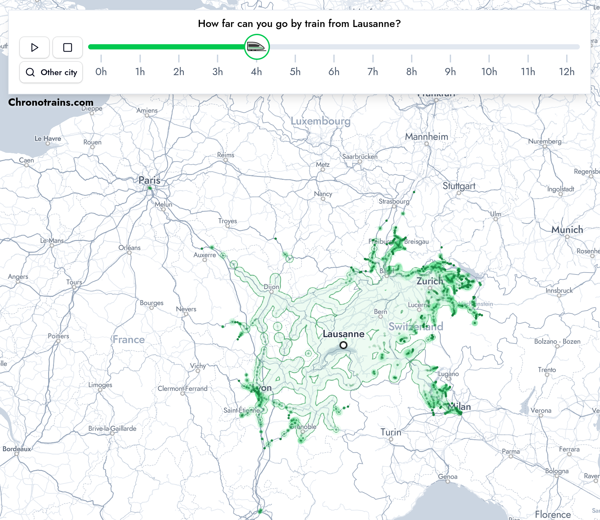

# Cartogram of Swiss Public Transport Travel Time (COM-480)

| Student's name | SCIPER |
| -------------- | ------ |
| CHIPLUNKAR Shardul | 353675 |
| GUAN Yawen | 353856 |
| PINAZZA Alexandre | 282395 |

[Milestone 1](#milestone-1) • [Milestone 2](#milestone-2) • [Milestone 3](#milestone-3)

## Milestone 1 (21st March, 5pm)

### Dataset

#### Source

We will use the [2025 Switzerland public transport timetable](https://data.opentransportdata.swiss/dataset/timetable-2025-gtfs2020) dataset, published by the SKI office on March 20, 2025 at the [Open Transport Data](https://opentransportdata.swiss/de/) platform.

#### Specification

The timetable dataset is stored in the [General Transit Feed Specification Format (GTFS)](https://gtfs.org/documentation/schedule/reference/). In GTFS terminology, a *route* is a group of trips that share a common branding, such as a train service (e.g., IC 5), and a *trip* is a single instance of a vehicle traveling along a route (e.g., IC 5 travels from Renens VD at 16:41 to Zurich HB at 18:56). 

Specifically, the timetable dataset contains the following 9 sub-datasets: 

- `agency.txt`: Information about transit agencies providing services. 
- `calendar.txt`: Regular service schedules. 
- `calendar_dates.txt`: Exceptions to the regular schedule (e.g., holidays).
- `routes.txt`: Transit routes. 
- `trips.txt`: Trips for each route. 
- `stops.txt`: Locations of stops. 
- `stop_times.txt`: Timetables specifying when trips serve each stop. 
- `transfers.txt`: Rules for making transfers between routes. 
- `feed_info.txt`: Metadata about the dataset. 

#### Data Quality

The data is high-quality as it is published by the Customer Information System Tasks (Systemaufgaben Kundeninformation or SKI) business office by order of the Swiss Federal Office of Transport.
It is in an industry-standard format used by world-wide applications that work with transit systems (e.g. Google Maps), and it contains all the information we need to calculate scheduled travel times.
It is also regularly updated (published every few days).

### Problematic

#### Motivation

We are used to standard maps where the distance between two locations reflects their physical geographic distance. However, in public transportation, what matters more than physical distance is the ***travel time***. For example, Genève to Bern (130 km) takes only 2 hours on a direct train, while a shorter route like Lugano to St. Moritz (90 km) takes about 4 hours due to mountainous terrain. What if a map used distance to represent travel time instead of the geographic distance?

#### Objective: Cartogram of Swiss Public Transport Travel Time

In this project, we are going to explore the concept of a ***cartogram***, a type of thematic map where the size or shape of the geographic regions is distorted to reflect a selected variable. 

We will focus on the travel time within Swizerland's public transport network, that is, the distance between two locations on the map reflects the travel time between them. **The cartogram visualization will shift the perspective from static geography to the real experience of movement through the public transport network.** 

If time permits, we will also explore other interesting variables such as commercial density. 

#### Target Audience

This visualization is designed for both commuters and urban planners:  

- For commuters, our cartogram can assist in planning daily commutes and travel planning; 
- For urban planners, our cartogram can help to better understand how transport infrastructure impacts mobility by highlighting well-connected areas, transit bottlenecks, and disparities in travel efficiency.

More broadly, we also see this visualization as a work of art that expresses a different perspective about time, distance, geography, and travel, and invites the viewer to think about what aspects of life different kinds of maps prioritize and ignore.

### Exploratory Data Analysis

The [preprocess](./notebooks/preprocess.ipynb) notebook details the data pre-processing steps needed to extract: 
- A list of all train stations in Switzerland; 
- A list of all stations in Lausanne, including metro, bus, and other public transport stops.

By analyzing the dataset, we confirmed that it contains all the necessary information for our project. Specifically, we are going to:
1. Compute the earliest arrival times for all destinations from a given starting location and time. 
2. Construct a complete graph, where edges represent trips and the weights correspond to travel time (arrival time - departure time).
3. Generate a graph layout using these travel time-based weights, employing a force-directed (or similar) algorithm.

### Related work

- [Chronotrains](https://www.chronotrains.com/en) provides an interactive visualization of train travel times across Europe. User can select a city and see how far they can travel within a given time. The map remains a standard geographic map with reachable cities marked in green. 

  

- [Worldmapper](worldmapper.org) platform provides some cartographic visualizations of various datasets. One example is the [Cartographic Views of the 2024 US Presidential Election](https://worldmapper.org/us-presidential-election-2024/) which includes [a cartogram of the election results](https://worldmapper.org/maps/us-presidential-election-2024-results/).
- Ongoing research on travel-time cartograms provides an academic foundation. For example, the study by Wang et al. [1] explores different design methodologies for constructing travel-time cartograms and offers insights for our project. 

Switzerland public transport timetable is widely used for various applications, but as for as we know, no one has applied a cartogram approach to this dataset.

Our approach is original: Chronotrains does not use cartograms, and Worldmapper maps are static and not focused on travel time. We aim to provide read-world usability and interactive exploration with the public transport data. 

[1] Wang, L., Ding, L., Krisp, J.M. *et al.* Design and Implementation of Travel-time Cartograms. *J. Cartogr. Geogr. Inf.* **68**, 13–20 (2018). doi:10.1007/BF03545340

## Milestone 2 (18th April, 5pm)

parts to do

* data processing: given a source and a datetime, compute travel time to all other stations
  + instead of 10km around Lausanne, what if we keep only the stops that TL lines cover
  + and the path to get there: what other stations does it pass through

* graph layout algorithm
  + spring layout. for each vertex, two springs, one connected to its original geographical location with preferred length zero, the other to the starting station with preferred length = travel time.
  + additional springs to match the actual path
  + three weights: travel time springs, source geography spring, destination geography springs

* web view

classes of interest
* maps
* graphs
* Storytelling with data and Creative coding
* D3.js

tools
* force-directed layout (D3 or other)
* jupyter
* Python csv library

sketches
* website skeleton

## Milestone 3 (30th May, 5pm)
