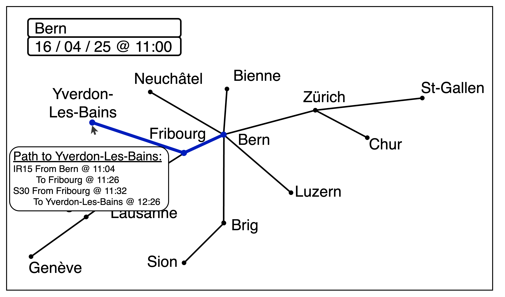

# Cartogram of Swiss Public Transport Travel Time (COM-480)

| Student's name | SCIPER |
| -------------- | ------ |
| CHIPLUNKAR Shardul | 353675 |
| GUAN Yawen | 353856 |
| PINAZZA Alexandre | 282395 |

📍[website](https://com-480-data-visualization.github.io/Cartarail/) •  [Setup](#Setup) • [Milestone 1](#milestone-1) • [Milestone 2](#milestone-2) • [Milestone 3](#milestone-3)

## Setup

### Project structure

```bash
.
├── assets
├── data
│   └── preprocessed
├── notebooks # jupyter notebooks for data preprocessing
├── README.md
├── scripts # python scripts for data preprocessing
└── www # frontend
    ├── dist
    ├── index.html
    ├── node_modules
    ├── package.json
    ├── package-lock.json
    ├── public
    ├── src
    ├── tsconfig.json
    └── vite.config.ts

```

### Get started

- install [node.js](https://nodejs.org)

- `cd` into the `www` directory

- run `npm install` to install dependencies

- For local development: run `npm run dev`. You should see output like:

  ```bash
    VITE v6.2.6  ready in 126 ms

    ➜  Local:   http://localhost:5173/
    ➜  Network: use --host to expose
    ➜  press h + enter to show help
  ```

- Generate static files and deploy to github pages:

  ```bash
  npm run build
  npm run deploy
  ```

## Milestone 1 (21st March, 5pm)

### Dataset

#### Source

We will use the [2025 Switzerland public transport timetable](https://data.opentransportdata.swiss/dataset/timetable-2025-gtfs2020) dataset, published by the SKI office on March 20, 2025 at the [Open Transport Data](https://opentransportdata.swiss/de/) platform.

#### Specification

The timetable dataset is stored in the [General Transit Feed Specification Format (GTFS)](https://gtfs.org/documentation/schedule/reference/). In GTFS terminology, a *route* is a group of trips that share a common branding, such as a train service (e.g., IC 5), and a *trip* is a single instance of a vehicle traveling along a route (e.g., IC 5 travels from Renens VD at 16:41 to Zurich HB at 18:56).

Specifically, the timetable dataset contains the following 9 sub-datasets:

- `agency.txt`: Information about transit agencies providing services.
- `calendar.txt`: Regular service schedules.
- `calendar_dates.txt`: Exceptions to the regular schedule (e.g., holidays).
- `routes.txt`: Transit routes.
- `trips.txt`: Trips for each route.
- `stops.txt`: Locations of stops.
- `stop_times.txt`: Timetables specifying when trips serve each stop.
- `transfers.txt`: Rules for making transfers between routes.
- `feed_info.txt`: Metadata about the dataset.

#### Data Quality

The data is high-quality as it is published by the Customer Information System Tasks (Systemaufgaben Kundeninformation or SKI) business office by order of the Swiss Federal Office of Transport.
It is in an industry-standard format used by world-wide applications that work with transit systems (e.g. Google Maps), and it contains all the information we need to calculate scheduled travel times.
It is also regularly updated (published every few days).

### Problematic

#### Motivation

We are used to standard maps where the distance between two locations reflects their physical geographic distance. However, in public transportation, what matters more than physical distance is the ***travel time***. For example, Genève to Bern (130 km) takes only 2 hours on a direct train, while a shorter route like Lugano to St. Moritz (90 km) takes about 4 hours due to mountainous terrain. What if a map used distance to represent travel time instead of the geographic distance?

#### Objective: Cartogram of Swiss Public Transport Travel Time

In this project, we are going to explore the concept of a ***cartogram***, a type of thematic map where the size or shape of the geographic regions is distorted to reflect a selected variable.

We will focus on the travel time within Swizerland's public transport network, that is, the distance between two locations on the map reflects the travel time between them. **The cartogram visualization will shift the perspective from static geography to the real experience of movement through the public transport network.**

If time permits, we will also explore other interesting variables such as commercial density.

#### Target Audience

This visualization is designed for both commuters and urban planners:

- For commuters, our cartogram can assist in planning daily commutes and travel planning;
- For urban planners, our cartogram can help to better understand how transport infrastructure impacts mobility by highlighting well-connected areas, transit bottlenecks, and disparities in travel efficiency.

More broadly, we also see this visualization as a work of art that expresses a different perspective about time, distance, geography, and travel, and invites the viewer to think about what aspects of life different kinds of maps prioritize and ignore.


### Exploratory Data Analysis

The [preprocess](./notebooks/preprocess.ipynb) notebook details the data pre-processing steps needed to extract:
- A list of all train stations in Switzerland;
- A list of all stations in Lausanne, including metro, bus, and other public transport stops.

By analyzing the dataset, we confirmed that it contains all the necessary information for our project. Specifically, we are going to:
1. Compute the earliest arrival times for all destinations from a given starting location and time.
2. Construct a complete graph, where edges represent trips and the weights correspond to travel time (arrival time - departure time).
3. Generate a graph layout using these travel time-based weights, employing a force-directed (or similar) algorithm.

### Related work

- [Chronotrains](https://www.chronotrains.com/en) provides an interactive visualization of train travel times across Europe. User can select a city and see how far they can travel within a given time. The map remains a standard geographic map with reachable cities marked in green.


- [Worldmapper](worldmapper.org) platform provides some cartographic visualizations of various datasets. One example is the [Cartographic Views of the 2024 US Presidential Election](https://worldmapper.org/us-presidential-election-2024/) which includes [a cartogram of the election results](https://worldmapper.org/maps/us-presidential-election-2024-results/).
- Ongoing research on travel-time cartograms provides an academic foundation. For example, the study by Wang et al. [1] explores different design methodologies for constructing travel-time cartograms and offers insights for our project.

Switzerland public transport timetable is widely used for various applications, but as for as we know, no one has applied a cartogram approach to this dataset.

Our approach is original: Chronotrains does not use cartograms, and Worldmapper maps are static and not focused on travel time. We aim to provide read-world usability and interactive exploration with the public transport data.

[1] Wang, L., Ding, L., Krisp, J.M. *et al.* Design and Implementation of Travel-time Cartograms. *J. Cartogr. Geogr. Inf.* **68**, 13–20 (2018). doi:10.1007/BF03545340


## Milestone 2 (18th April, 5pm)

Our project aims to calculate and visualize a ***catogram*** of the travel time taken by public transport, starting from a specific location and time, as depicted in the following sketch:


The user must input a starting location and starting time because public transport travel times are not symmetrical. For instance, if you depart at 11:00 AM on April 16th, it takes 51 minutes to travel from Lausanne to Geneva, but only 44 minutes to do the trip in the opposite direction.
In addition, starting at a different time can change the travel time due to irregular transport schedules; and if we computed the travel time between all pairs of points on the map instead of from a single starting location, the result would be harder to interpret and sometimes ill-defined (as in the asymmetric case above).

Once the visualization is computed and displayed, the user can hover over a station, which will create a window displaying the quickest itinerary to that station, as illustrated in the following sketch:



### Data Processing

The data processing is split into two parts, the first part is independent of the starting location and time and so can be done once. The second part compute the earliest arrival time from a starting location and time.

#### Preprocessing

The dataset contains over a billion trips, making over 12 billions stops in 30'000 destinations. These numbers are too big, so we want to preprocess the dataset to only keep trains or transportation in a 10 km radius around EPFL.

#### Quickest path discovery

Once the preprocessing is complete, Dijkstra’s algorithm is employed to compute the quickest arrival time for each destination. This algorithm provides the earliest arrival time to all destinations along with the corresponding path to reach those destinations.

Note that this algorithm give the earliest arrival time and not necessary the shortest travel time to a destination. For example, starting from Lausanne at 11:20, this algorithm will give the following path to Bière:
- IR 15 From Lausanne @ 11:23 to Morges @ 11:33
- R 56 From Morges @ 11:54 to Bière @ 12:25

Giving us a total travel time of 62 minutes, including 21 minutes of waiting at Morges.

If we query the [SBB website](sbb.ch/en) with the same trip we get the following result:
- R 8 From Lausanne @ 11:34 to Morges @ 11:48
- R 56 From Morges @ 11:54 to Bière @ 12:25

Giving us a total travel time of 51 minutes, including only 6 minutes of waiting at Morges.

The difference is caused by our algorithm choosing the earliest available trip to Morges even though the next one would also work to catch the R 56 connection.

### Vizualization

Once we have the earliest arrival time for every destination and the route to reach them, we visualize it using a spring layout.
There are three types of springs:
- Between the source and each destination, with a preferred length proportional to the total travel time.
- Between each destination and the previous stop on the way from the source, if it exists, with a preferred length proportional to the time of the last leg. This is to encourage the layout to reflect the paths taken.
- Between each stop and its geographical location, with a preferred distance of 0. This is to encourage the layout to not diverge too much from actual geography.

We set the strengths of these spring forces to be in appropriate balance.

### Tools and classes

For our project, the classes of most interest are the classes on maps, graphs, storytelling with data and creative coding, and D3.js.
For the data processing, we are using jupyter notebooks, pandas and Python's csv libraries. For the vizualization layout, we are using the [force-directed layout](https://d3js.org/d3-force) module of D3.

### Extra ideas of improvements

We have three main ideas to improve our vizualization:
* Warping other map features like lakes, mountains, and borders to enhance the visualization of the warping. However, this approach faces a challenge in preserving the order between cities. For instance, traveling from Bussigny to Yverdon-Les-Bains is sometimes quicker via Renens. Consequently, our visualization will attempt to align these cities in the order Bussigny -> Renens -> Yverdon-Les-Bains. We thus cannot rely on the relative position between those cities and map features to find a new location for them.
* We are currently only considering travel using public transport but sometime walking is faster or not reachable by public transport. Taking these walkable distances could make the travel time more realistic.
- Another way to make the travel time more realistic is to take into account transfer time at station. We currently assume an instantaneous transfer between the platform of a train stations and the surrounding bus stops. The dataset contains a `transfer.txt` file which gives us this minimum transfer time.

### Prototype

To have a local version of the webpage which display the travel time from Lausanne to a few cities of Switzerland, you need to have `npm` installed on your machine and then run the following command inside the `www` directory:

```bash
$ npm install && npm run dev
```

It will display a link to open in your web-browser to see the vizualization which looks like the following:


The red dots are the original location of the cities and the black one are the locations adjusted for the travel time from Lausanne at 16:20 on Apr 17. The gray lines are the springs used in the layout.

## Milestone 3 (30th May, 5pm)
